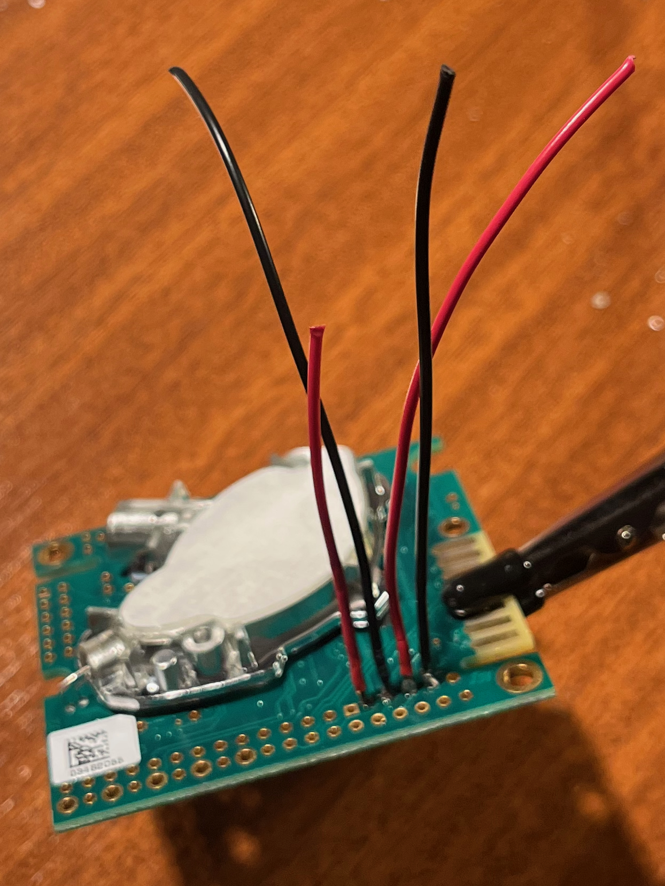
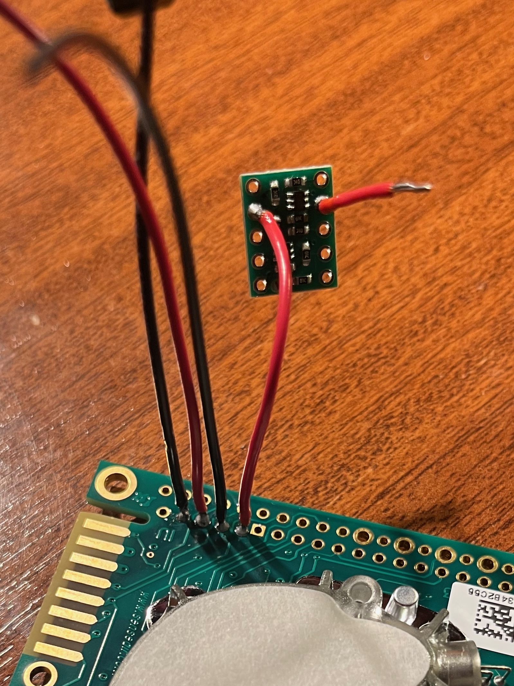
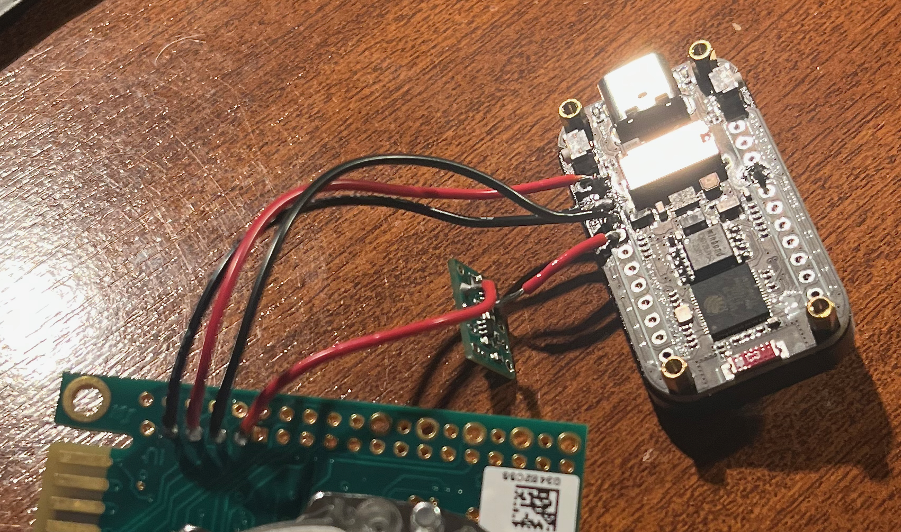
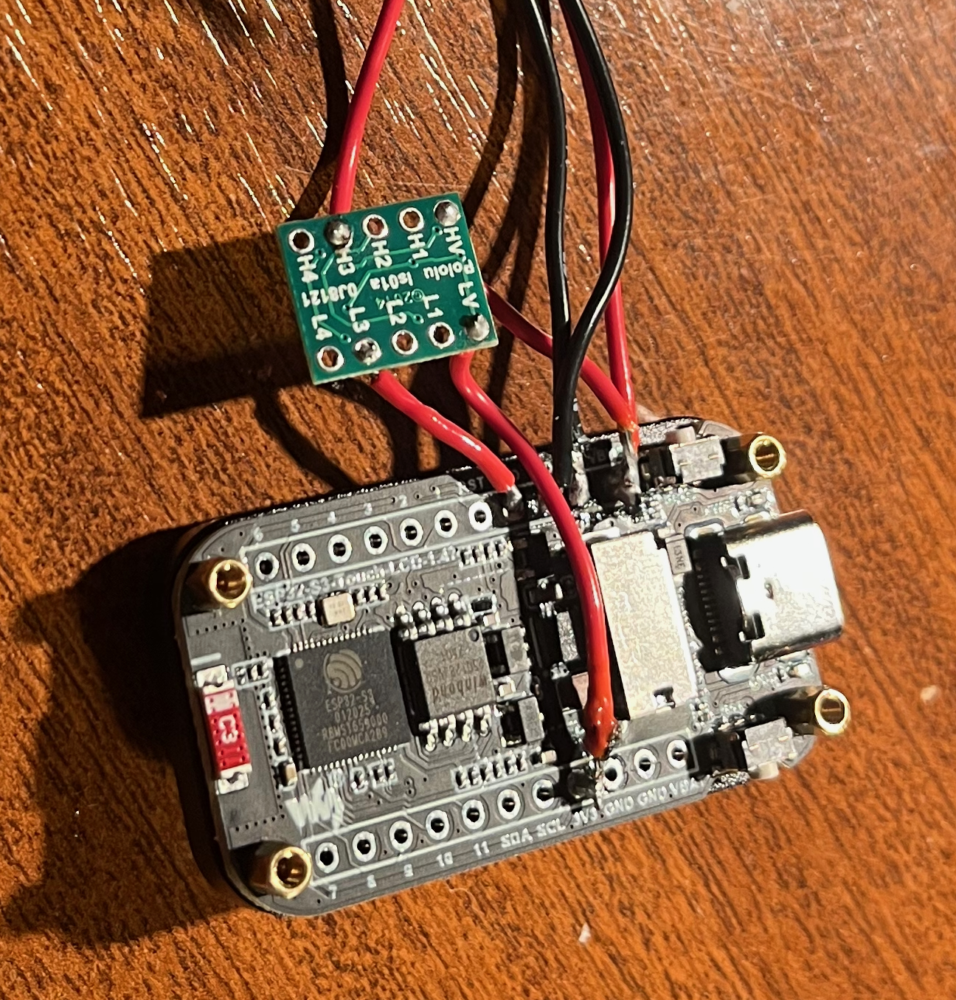
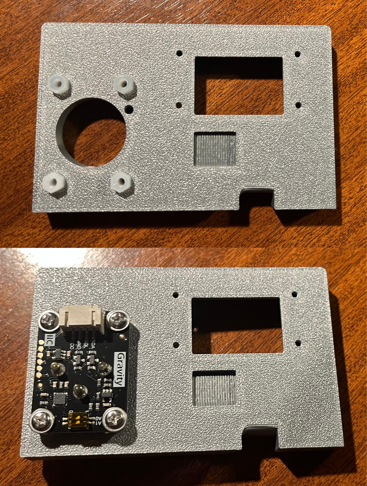
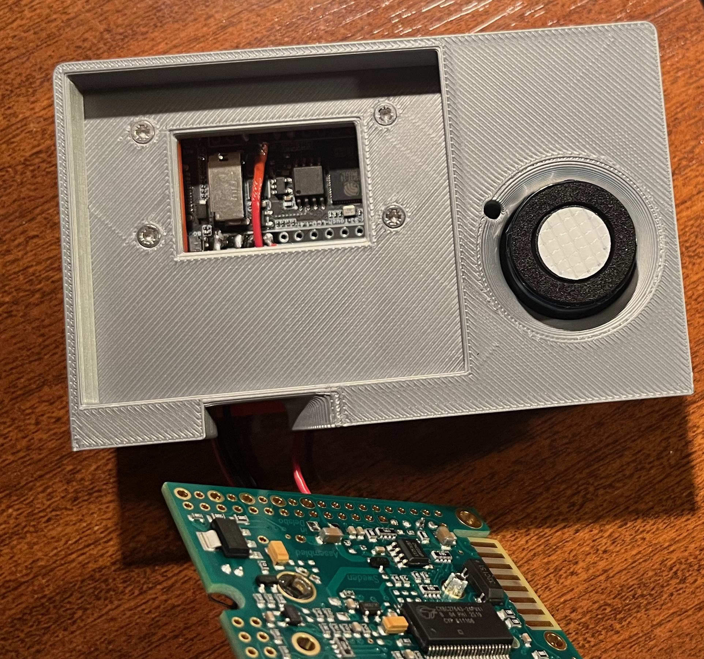
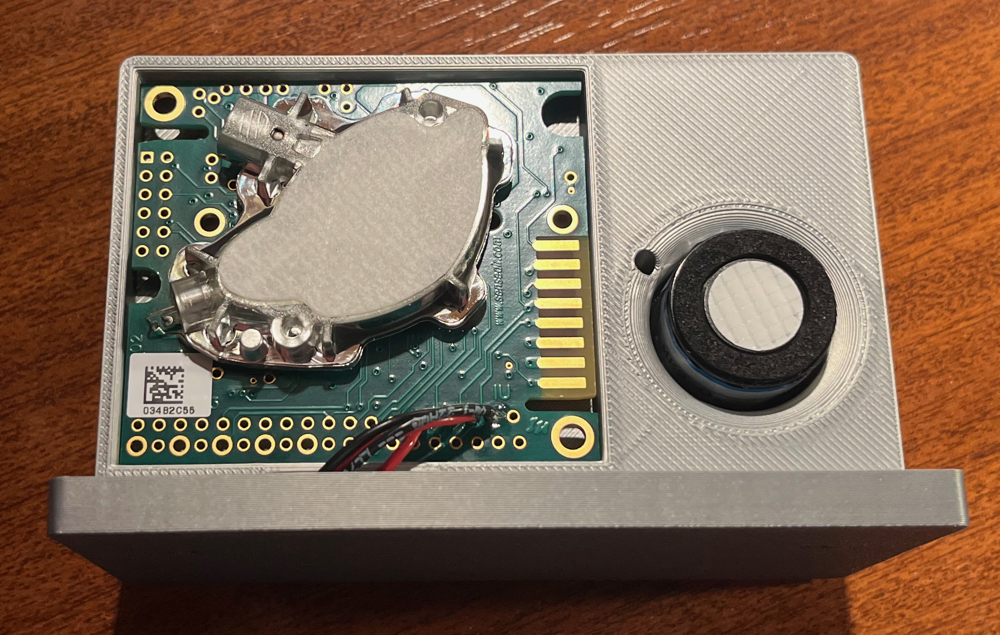

# Assembly Guide

This guide details the physical assembly and wiring of the environmental gas monitor. Please ensure all 3D-printed parts are clean and free of support material before beginning. 

This guide covers both variants. Steps unique to the CO₂ + O₂ variant are marked **[CO₂+O₂ only]**.

> **Before You Start:** Read through the complete guide before beginning. Have the [BOM](../../hardware/bom/) and [schematic](../../hardware/schematics/) open alongside this guide.
---

## Materials & Prep

**Required Tools:**
* Soldering iron & solder (fine tip recommended)
* Wire strippers/cutters
* M2 x 8mm screws (x4)
* Small Phillips head screwdriver
* Small flathead screwdriver (for O₂ sensor I²C dial)

**Wire Preparation:**
Cut and strip the following lengths of wire (tin the tips for easier soldering):
* **8.0 cm (x3):** For K30 GND, PWR, and TXD.
* **5.5 cm (x1):** For K30 RXD.
* **1.5 cm (x2):** For Logic Shifter LV-side data lines.
* **~4.0 cm (x1):** For Logic Shifter LV power line.
* **~2.0 cm (x1):** For Logic Shifter HV power line.
* **[CO₂+O₂ only]:** Four standard Dupont jumper wires for the SEN0322 (usually included with the connector on the device).

## Phase 1: Print the Enclosure
 
Print the plate, fascia and base from the files in `hardware/3d-print/stl/`. Use the settings in the [3D print README](../../hardware/3d-print/).
- Ensure to remove all of the support material from parts.
- **[CO₂+O₂ only]** there are some difficult to remove supports in the channel of the fascia wherer the SEN0322 cables are routed.

 
**[CO₂+O₂ only]** Use the `co2_o2/` STL files, which includes the SEN0322 sensor port.

##  Phase 2: Soldering & Component Prep

*(Please refer to the included schematics for visual pinout confirmation. We recommend color-coding your wires: Red for 5V, Black for GND, and distinct colors for data lines).*

### 1. Wire the K30 Sensor
1. Solder **8 cm** wires to the **GND**, **PWR (G+)**, and **RXD** pads of the K30 sensor.
2. Solder the **5.5 cm** wire to the **TXD** pad of the K30.

### 2. Connect to the Logic Shifter
*The Logic Shifter protects the 3.3V ESP32 from the 5V signals of the K30.*
1. Solder the **5.5 cm RXD** wire coming from the K30 to the **H3** channel on the logic shifter.
1. Solder a **1.5 cm** wire to the **L3** pad.

### 3. Wire the ESP32-S3 (Main Brain)
Now, connect everything back to the ESP32 microcontroller:
1. **Power:** Solder the K30 **PWR** wire to the ESP32 **VBUS (5V)** pin.
2. **Ground:** Solder the K30 **GND** wire to the ESP32 **GND** pin. 
3. **Data (TX to K30):** Solder the **1.5 cm L3** wire to the ESP32 **RXD** pin.
4. **Data (RX from K30):** Solder the **8 cm** wire to the ESP32 **TXD** pin.

### 4. Power the Logic Shifter
The logic shifter needs reference voltages to know how to translate the signals.
1. Solder the **~2 cm** wire from the ESP32 **VBUS (5V)** pin to the **HV** pad on the logic shifter.
2. Solder the **~4 cm** wire from the ESP32 **3V3 (3.3V)** pin to the **LV** pad on the logic shifter.

### 5. [CO₂+O₂ only] Prepare the SEN0322 O₂ Sensor
The SEN0322 comes ready to use but requires configuration:
1. Set the I²C address dial to **position 3** (address `0x73`) to avoid conflicting with the touchscreen controller. The dial is on the top face of the board; use a small flathead screwdriver.
2. Connect the four wires:
   * **VCC** → ESP32 **3V3 (3.3V)**
   * **GND** → Common ground.
   * **SDA** → ESP32 **GPIO42**.
   * **SCL** → ESP32 **GPIO41**.

---

## Phase 3: Bench Test Before Assembly

Before fitting anything into the enclosure, do a bench test with all components loose:

1. Insert the microSD card (FAT32 formatted).
2. Power the ESP32 via USB-C.
3. The display should light up and show the boot sequence. After warmup, the K30 should start returning readings.
4. **[CO₂+O₂ only]** The O₂ reading should appear after ~5 seconds.

Check the serial monitor in Arduino IDE (115200 baud) for any error messages. Common issues:

| Error Message | Likely Cause |
| :--- | :--- |
| **SD mount failed** | SD card not formatted as FAT32, or not inserted correctly. |
| **CO2 disconnected** | Level shifter wiring issue — check LV/HV reference connections and data routing. |
| **O₂ sensor not found** | Check SDA/SCL connections and ensure VCC is on 5V, not 3.3V. |
| **Display blank** | Backlight GPIO46 not driven — usually indicates wrong board selected in Arduino IDE. |

> ⚠️ **Do not proceed to enclosure assembly until all sensors are reading correctly.**

---

##  Phase 4: Physical Enclosure Assembly

### 1. Mount the ESP32 Fascia
* Carefully slide the ESP32-S3 screen-first through the slot in the 3D-printed **Fascia** part.
* Gently route and line up the attached cables so they point toward the back.
* **[CO₂+O₂ only]** - pass the SEN0322 connector through the slot in the fascia into the right hand side.

### 2a. [CO₂+O₂ only]: Mount the oxygen sensor on the plate
* Push the included hexagonal standoffs into the cutouts on the plate.
  * Depending on the tolerances of your print, you may need to shave down the hexagonal edges end of the standoffs so that they can be push fit into the plate.
* Use the included fixings to attach the sensor to the plate, ensuring the calibration button aligns with the cutout in the plate.

### 2. Secure the Core Plates
* **[CO₂+O₂ only]** connect the SEN0322 connector to the sensor.
* Offer up the **Plate** part to the back of the Fascia.
* Line up the holes for the M2 screws so they pass through the Fascia, the ESP32 mounting holes, and into the Plate.
* Secure the assembly using the **M2x8mm screws**. Do not overtighten, as this can crack the plastic or the ESP32 PCB.

### 3. Seat the Logic Shifter & Sensors
* Position the Logic Shifter snugly into its dedicated cutout on the back of the Plate.
* Route the wiring to pass cleanly underneath using the bottom cutout.
* Take the wired **K30 sensor** and press it lightly into the Plate. This is a friction/push-fit design and should seat firmly.

### 4. Attach the Base
Choose your preferred finish for the bottom of the device:
* **The Base:** Attach this push-fit part if you want the device to have a stand-like appearance.
* **The Insert:** Use this part if you prefer a flush, flat-bottom, low-profile finish.

---

##  Phase 5: Final Power-on & Configuration

1. Power via USB-C. Confirm the display shows the correct boot sequence and readings.
2. Connect to the sensor's WiFi hotspot on your phone/laptop and navigate to `192.168.4.1`.
3. Verify the web interface loads and shows the same readings as the physical device display.
4. Use the Web UI Settings page to configure the `deviceName`, `location`, and target WiFi credentials for the intended installation location.

---