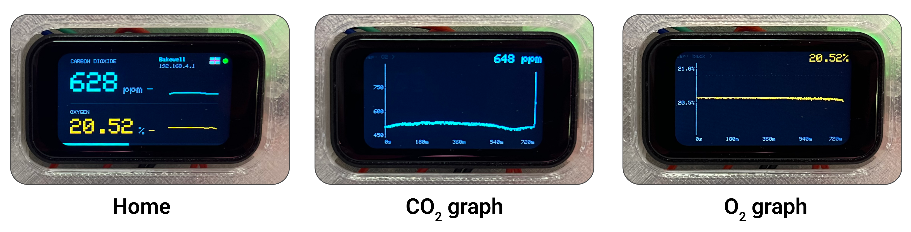

---
hide:
  - navigation
---

# Canary Gas Monitoring

  

An open-source, networked gas monitoring system for laboratory growth chambers, built around the ESP32-S3 microcontroller.

Continuously measures CO₂ (and optionally O₂), logs data locally to SD storage, and streams live telemetry to a central Grafana dashboard through a Raspberry Pi hub.

  ESP32-S3
  CO₂ Monitoring
  Grafana
  Open Source

  <a href="https://github.com/james-r-barrett/gas_monitoring"
     target="_blank"
     class="hero-btn github-btn">

    <svg xmlns="http://www.w3.org/2000/svg"
         viewBox="0 0 496 512"
         width="16"
         height="16"
         fill="currentColor">

      <path d="M165.9 397.4c0 2-2.3 3.6-5.2 3.6-3.3.3-5.6-1.3-5.6-3.6 0-2 2.3-3.6 5.2-3.6 3-.3 5.6 1.3 5.6 3.6zM244.8 8C106.1 8 0 113.3 0 252c0 110.9 69.8 205.8 169.5 239.2 12.8 2.3 17.3-5.6 17.3-12.1 0-6.2-.3-40.4-.3-61.4 0 0-70 15-84.7-29.8 0 0-11.4-29.1-27.8-36.6 0 0-22.9-15.7 1.6-15.4 0 0 24.9 2 38.6 25.8 21.9 38.6 58.6 27.5 72.9 20.9 2.3-16 8.8-27.1 16-33.7-55.9-6.2-112.3-14.3-112.3-110.5 0-27.5 7.6-41.3 23.6-58.9-2.6-6.5-11.1-33.3 2.6-67.9 20.9-6.5 69 27 69 27 20-5.6 41.5-8.5 62.8-8.5s42.8 2.9 62.8 8.5c0 0 48.1-33.6 69-27 13.7 34.7 5.2 61.4 2.6 67.9 16 17.7 25.8 31.5 25.8 58.9 0 96.5-58.9 104.2-114.8 110.5 9.2 7.9 17 22.9 17 46.4 0 33.7-.3 75.4-.3 83.6 0 6.5 4.6 14.4 17.3 12.1C428.2 457.8 496 362.9 496 252 496 113.3 389.9 8 244.8 8z"/>
    </svg>

    View on GitHub
  </a>

  <a href="https://jamesrbarrett.grafana.net/public-dashboards/2842727a8849425480e023f71c46eba7"
     target="_blank"
     rel="noopener noreferrer"
     class="hero-btn grafana-btn">

    Open Mackinder Dashboard ↗
  </a>

---
## Overview

<!-- PLACEHOLDER: Hero image showing the assembled sensor unit on a growth chamber -->
<!-- Replace with:  -->

The system was developed in the [Mackinder Lab](https://mackinderlab.weebly.com/) at the [Centre for Novel Agricultural Products (CNAP)](https://www.york.ac.uk/biology/centre-for-novel-agricultural-products/), University of York, to provide continuous, networked gas monitoring across multiple algae growth chambers.

Key design goals:

- **No cloud dependency for core function** — all data logged locally to SD card; Pi and Grafana are optional additions
- **Easy to deploy** — web-configurable without reflashing; each sensor is a self-contained unit
- **Long-term logging** — FAT32 SD card with >20 years capacity at 5-second intervals
- **Lab-realistic calibration** — explicit guidance for CO₂ calibration in a real laboratory gas supply context

---

## Features

- **Two sensor variants** — CO₂-only and combined CO₂/O₂
- **Touchscreen display** — live readings, trend indicators, sparkline history, and graph pages
- **Local web interface** — live readings, full-resolution graphs, calibration, settings, and CSV download at `192.168.4.1`
- **Networked monitoring** — sensors push to a Raspberry Pi hub forwarding to Grafana Cloud
- **Automatic time sync** — from Raspberry Pi on connection, or from any browser as fallback
- **Fully configurable at runtime** — read interval, graph window, device name, location, WiFi credentials via web UI
- **K30 CO₂ calibration** — 0 ppm and 400 ppm via touchscreen and web interface
- **USB analyser bridge** — Minir-5 and K30 1% mixing bottle monitors via laptop Python scripts
- **Optional solenoid control** — hardware provision for automated CO₂ dosing

---

## Sensor Variants

| Feature | CO₂ only | CO₂ + O₂ |
|---|---|---|
| CO₂ measurement | ✓ K30 NDIR (0–10,000 ppm) | ✓ K30 NDIR (0–10,000 ppm) |
| O₂ measurement | — | ✓ SEN0322 (0–25%) |
| Touchscreen display | ✓ 1.47" | ✓ 1.47" |
| SD card logging | ✓ | ✓ |
| Local web interface | ✓ | ✓ |
| Raspberry Pi push | ✓ | ✓ |
| O₂ sensor lifetime | — | ~2 years (replaceable) |

---

## System Architecture

  <h3>ESP32 Sensor Units</h3>
  
One per growth chamber

→ WiFi (GasMonitor) →

  <h3>Raspberry Pi Hub</h3>
  <ul>
    <li>Flask receiver</li>
    <li>InfluxDB (local)</li>
    <li>Grafana Cloud sync</li>
  </ul>

  <h3>Windows / Linux Laptop</h3>
  
Minir-5 + K30 1%

→ WiFi (GasMonitor) →

  <h3>Same Pipeline</h3>
  
Sent to Raspberry Pi hub

## Gallery

Hardware & Displays

  
  

    <h3>Assembled Sensor</h3>
    
Fully assembled devices.

  

  
  

    <h3>Display Screens</h3>
    
Snapshots of the screens shown on the combined device.

  

Web Interface

  
  

    <h3>Web UI</h3>
    
Browser-based monitoring interface.

  

  
  

    <h3>Grafana Dashboard</h3>
    
Live metrics and historical visualizations.

  

---

## Getting Started

  <a href="hardware/" style="text-decoration:none; background:#f8f9fa; border:1px solid #e0e0e0; border-radius:8px; padding:20px; display:block; color:inherit;">
    
🔧

    
Hardware

    
Parts list, schematics, and 3D print files

  </a>

  <a href="firmware/" style="text-decoration:none; background:#f8f9fa; border:1px solid #e0e0e0; border-radius:8px; padding:20px; display:block; color:inherit;">
    
💾

    
Firmware

    
Arduino IDE setup, libraries, and flashing

  </a>

  <a href="guides/assembly/" style="text-decoration:none; background:#f8f9fa; border:1px solid #e0e0e0; border-radius:8px; padding:20px; display:block; color:inherit;">
    
📋

    
Assembly

    
Step-by-step build guide with photos

  </a>

  <a href="server/" style="text-decoration:none; background:#f8f9fa; border:1px solid #e0e0e0; border-radius:8px; padding:20px; display:block; color:inherit;">
    
🖥️

    
Raspberry Pi

    
Hub setup, InfluxDB, and Grafana

  </a>

  <a href="guides/user-guide/" style="text-decoration:none; background:#f8f9fa; border:1px solid #e0e0e0; border-radius:8px; padding:20px; display:block; color:inherit;">
    
📖

    
User Guide

    
Day-to-day operation and calibration

  </a>

  <a href="laptop-bridge/" style="text-decoration:none; background:#f8f9fa; border:1px solid #e0e0e0; border-radius:8px; padding:20px; display:block; color:inherit;">
    
🔌

    
Laptop Bridge

    
USB analyser scripts for Minir-5 and K30

  </a>

---

## Built With

| Component | Role |
|---|---|
| [Waveshare ESP32-S3](https://www.waveshare.com) | Sensor microcontroller with touchscreen |
| [SenseAir K30](https://senseair.com) | NDIR CO₂ sensor |
| [DFRobot SEN0322](https://dfrobot.com) | Electrochemical O₂ sensor |
| [Raspberry Pi 5](https://www.raspberrypi.com) | Central hub and WiFi access point |
| [InfluxDB](https://influxdata.com) | Local time-series database |
| [Grafana](https://grafana.com) | Dashboard and remote monitoring |
| Arduino IDE | Firmware development |
| Autodesk Fusion | Enclosure 3D design |

---

## Acknowledgements

Developed at the [Centre for Novel Agricultural Products (CNAP)](https://www.york.ac.uk/cnap/), University of York.
Thanks to Mark Bentley [(Biology workshops)](https://www.york.ac.uk/biology/current-students-staff/mech-workshop/) for helping with the enclsoure design and print steps.

<!-- PLACEHOLDER: CNAP / University of York logo -->